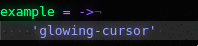
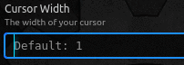
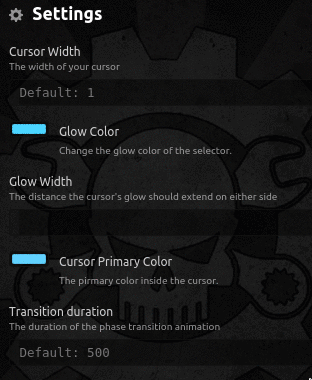
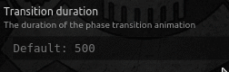

Glowing Cursor blink:

# Glowing Cursor
A customizable glowing colorful cursor for Atom.

## Features
* #### adjustable width of cursor and the glow
 * 

* #### configurable color of cursor and its glow
 * 

* #### configurable blink speed (0 is blink, 500ms is phase in and out)
 * 

## Complementing themes and plugins
* ### Syntax
 * Steam Pirate Syntax: https://atom.io/themes/steam-pirate-syntax
 * Neon Syntax: https://atom.io/themes/neon-syntax
* ### UI themes
 * Steam Pirate UI: https://atom.io/themes/steam-pirate-ui
* ### plugins
 * Neon Selection: https://atom.io/packages/neon-selection

#### Example using Steam Pirate UI, Neon Syntax, Neon Selector and Glowing Cursor

### Inspired by and Referenced for development:
 * Neon Cursor: https://atom.io/packages/neon-cursor
 * Pulsing Cursor: https://atom.io/packages/pulsing-cursor
 * Block Cursor: https://atom.io/packages/block-cursor
